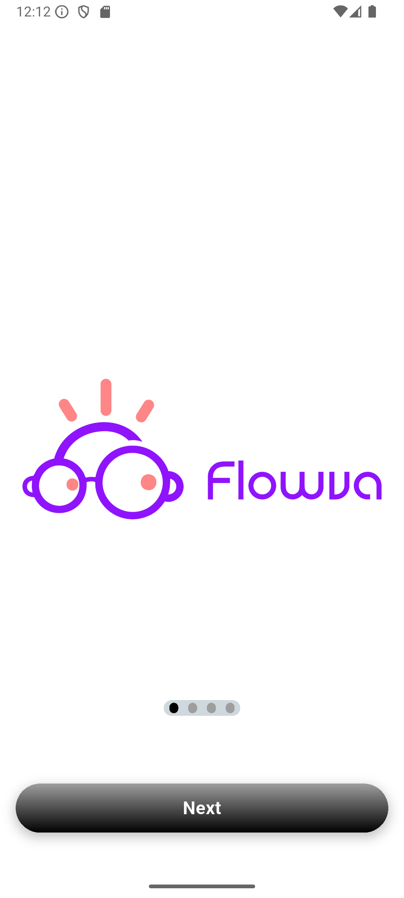
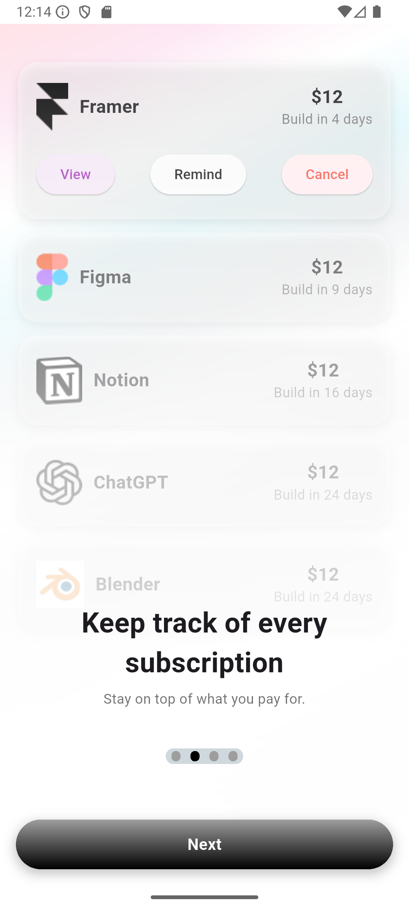
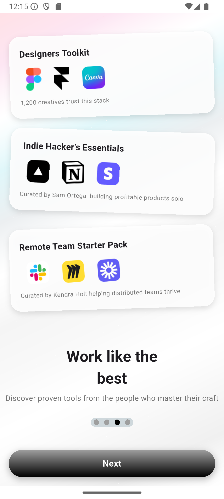

```md
# 🌊 Flowva - Flutter Test Assessment

Welcome to **Flowva**, a modern and sleek Flutter app developed as part of a **test assessment project**.  
This project demonstrates clean architecture, reusable components, and scalable folder structuring in Flutter.

---

## 📸 Screenshots  
| Intro Page | Intro Page 1 | Intro Page 2 |
|------------|-------------|--------------|
|  |  |  |

---

## 🚀 Features  
- ✨ **Beautiful onboarding flow** with multiple intro screens  
- 🧩 **Reusable UI widgets** for consistent styling  
- ⚡ **Optimized state management** for smooth performance  
- 🎨 **Custom design components** like subscription and tool cards  
- 📱 **Responsive design** for various screen sizes  

---

## 🗂️ Project Structure  
```

Flowva/
│
├── images/                       # App assets and screenshots
│
├── lib/
│   ├── main.dart                 # Entry point of the application
│   │
│   ├── views/                    # Screens and view logic
│   │   ├── intro\_page.dart       # Intro Page
│   │   ├── intro\_page1.dart      # Intro Page 1
│   │   ├── intro\_page2.dart      # Intro Page 2
│   │   ├── intro\_viewmodel.dart  # ViewModel for intro screens
│   │   │
│   │   └── reuseables/           # Reusable UI components
│   │       ├── subscription\_card.dart
│   │       └── tool\_card.dart
│   │
│   └── ...
│
└── pubspec.yaml                  # Dependencies and assets configuration

````

---

## 🛠️ Tech Stack  
- **Flutter** (v3.32.5)  
- **Dart** (v3.8.1)  
- **Provider | Stack / ViewModel pattern** for state management  
- **Clean UI architecture** for scalability  

---

## 🔧 Getting Started  

### **Prerequisites**
Ensure you have:
- [Flutter SDK](https://flutter.dev/docs/get-started/install)
- [Dart](https://dart.dev/get-dart)
- An IDE like [Android Studio](https://developer.android.com/studio) or [VSCode](https://code.visualstudio.com/)

---

### **Installation**
```bash
# Clone the repository
git clone https://github.com/Heebu/flowva.git

# Navigate into the project
cd flowva

# Install dependencies
flutter pub get

# Run the app
flutter run
````

---

## 🧑‍💻 Developer

**Idris Adedeji (Heebu Prime)**

* 💼 [Portfolio](https://my-cv-app-theta.vercel.app/)
* 💻 [GitHub](https://github.com/Heebu)
* 🔗 [LinkedIn](https://www.linkedin.com/in/idris-adedeji-1b3162246/)

---

## 📜 License

This project is licensed under the **MIT License**.
Feel free to use, modify, and share with proper attribution.

---

## ⭐ Acknowledgment

Big thanks to the **Flowva team** and the reviewers for this assessment opportunity. 🙌

```

---

Would you like me to add **status badges** (like Flutter version, GitHub Actions, or Platform support) to make it more professional?
```
